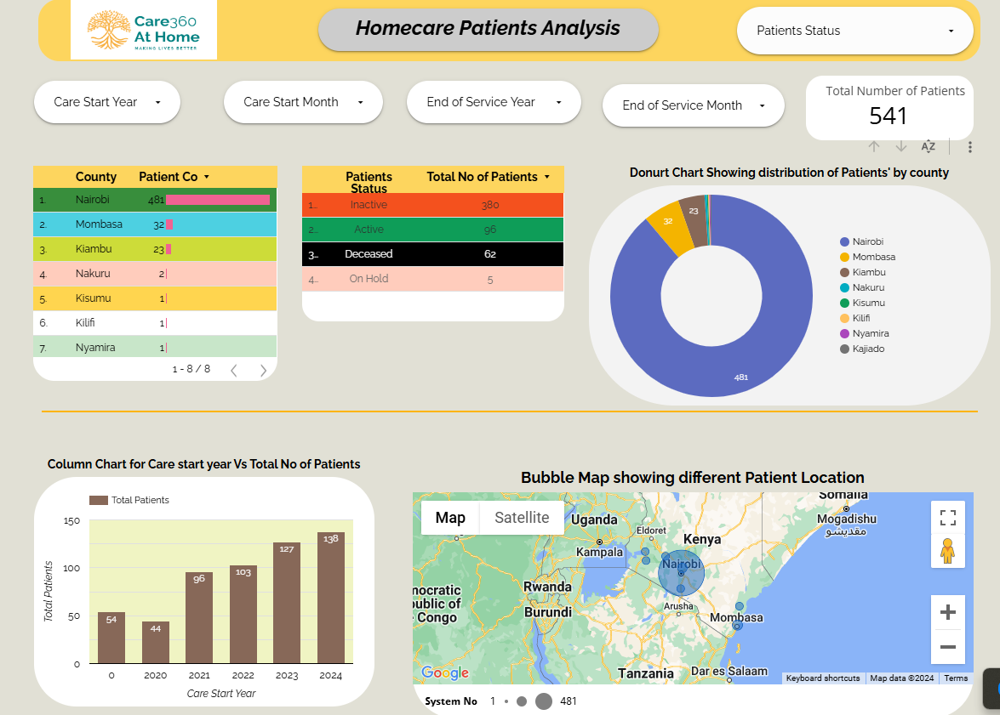

# Homecare Dashboard

This is a Looker Studio Dashboard for visualizing key metrics related to homecare operations, including patient demographics, service efficiency, and patient summary statistics.
### Key Features
- Track patient metrics
- Visualize service performance.
- Analyze operational efficiency and trends over time.

### Access the Dashboard
[View the Homecare Dashboard](https://lookerstudio.google.com/reporting/937744a9-25e2-496e-bd72-54956ab2bfbc/page/VibuD)

### Screenshots

